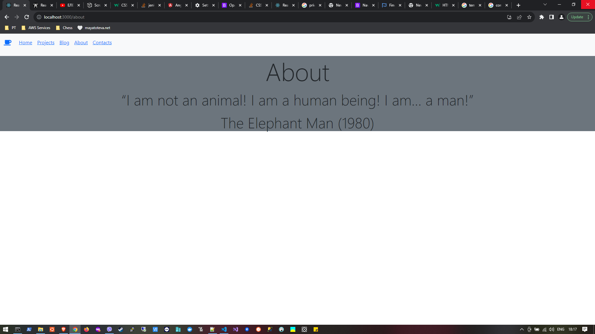

# PT_Demo_React_Routing



# Contents

- [General Information](#general-information)
- [Routing](#routing)
- [Links](#links)

## General Information

## Routing

To implement Routing in Create-React-App (CRA), do the following:

1. Execute the following npm command in order to install `React-Router-DOM` package:

```
npm install react-router-dom@6
```

2. In `App.js` component, implement the following:

```
import { Routes, Route, BrowserRouter } from 'react-router-dom';
import Layout from './components/Layout/Layout.js';
...

export default function App() {
  return (
    <BrowserRouter>
      <Routes>
        <Route path="/" element={<Layout />}>
          <Route index element={<Home />} />
          <Route path="projects" element={<Projects />} />
          ...
          <Route path="*" element={<ErrorPage />} />
        </Route>
      </Routes>
    </BrowserRouter>
  );
}
```

3. In the `Layout.js` component, implement the following:

```
import { Link, Outlet } from 'react-router-dom';

export default function Layout() {
    return (
        <div>
            <p>Layout</p>
            <ul>
                <li><Link to="/">Home</Link></li>
                <li><Link to="/projects">Projects</Link></li>
                ...
            </ul>
            <Outlet />
        </div>
    )
}
```

## Links

- https://hygraph.com/blog/routing-in-react
- https://www.w3schools.com/react/react_router.asp